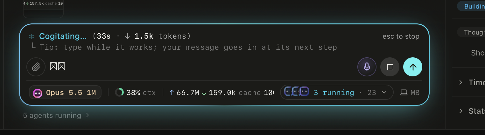
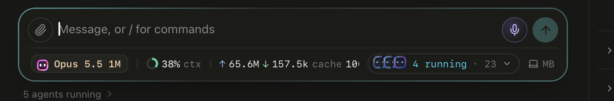

# HaloRim

The glowing glass box around Agent Base's chat composer (R1.19, "option A, Halo rim"). Shaan, 3 Oct 2026, 00:30:
"that chat ui is perfect beautiful ... i would love to save how it works". This is that box, kept for reuse: the chat
composer and the right panel's floating card are built from it.




His two screenshots of the live composer (3 Oct, 00:30): working, then idle.

```tsx
import { HaloRim } from "@siso/shell";

<HaloRim state={working ? "working" : "idle"} hue="rgb(34 211 238)">
  …anything: a live line, an input row, a HUD row, a card's content
</HaloRim>
```

## States

| `state` | Ring | Motion |
|---|---|---|
| `idle` (default) | a diagonal gradient from `--rim-hue` into the dark, a soft dark shadow | still |
| `working` | a conic gradient `--rim-hue` → `--rim-cyan` → back, with an outer glow in both | turns once every 6 s |
| `voice` | the same ring in violet and pink | turns once every 3 s |

Any child carrying `data-phase="listening"` (Agent Base's mic, `MicButton`) switches the rim to voice by itself, so the
mic needs no wiring; `data-phase="starting"` or `"writing"`, or `data-speaking="true"` (the speaker toggle), keep the
violet ring without the turning. Reduced motion stops the turning in every state.

## Props

| Prop | Type | |
|---|---|---|
| `state` | `"idle" \| "working" \| "voice"` | as above; also written to `data-state` |
| `hue` | any CSS colour | the ring's own colour (`--rim-hue`); Agent Base passes the agent's project colour. Default: the brand orange |
| `glow` | `boolean` (default `true`) | `false` drops the outer light, for a rim inside something that already glows |
| `children` | React nodes | the content; each child sits above the ring layer |
| anything else | `div` props | `className`, `style`, `data-testid`, handlers pass through |

## CSS tokens

Set on `.siso-rim` (inline through `hue`, or in your own CSS):

| Token | Default | What it paints |
|---|---|---|
| `--rim-hue` | `rgb(var(--crm-brand-rgb))` | the ring's first colour and the warm half of the glow |
| `--rim-cyan` | `#22D3EE` | the ring's second colour and the cool half of the glow (the app's "working" colour) |
| `--siso-voice`, `--siso-voice-2` | `#a78bfa`, `#f472b6` (on `:root`) | voice's violet and pink: the voice ring, and the mic orb and speaker toggle beside it |
| `--rim-fill` | `#1b1b19` | not painted by the rim: a colour children use to sit flush with the glass (the mic orb's centre) |
| `--rim-ring` | the conic (working, voice) or diagonal (idle) gradient | the ring itself; override it for a different ring |

How it is drawn: the box is translucent (`rgb(27 27 25 / .84)`) with an 18 px backdrop blur, so whatever scrolls under it
shows through, softened. The 1.5 px ring is a `::before` layer masked to a ring, so the glass never shows the gradient
through its middle. The turning animates the registered property `--siso-rim-ang`. Radius 20 px, padding 7.5 px 11.5 px.

Files: `HaloRim.tsx` (the component), `halo-rim.css` (the look; the component imports it, and the package exports it as
`@siso/shell/halo-rim.css`). The chat-only pieces (the live line, the └ step line, the composer floating over the list)
stay in Agent Base's `apps/web/src/components/Composer.css`.
